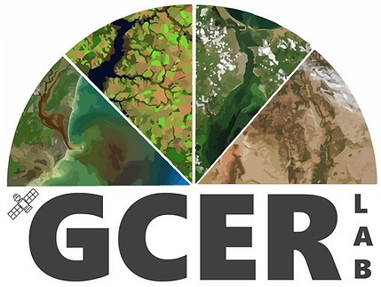

# Example project
It's an example repository intended to demonstrate how to create a geospatial project with Python using good software development practices. It's also intended to be used as a template for future projects.

This repository is organized as a Python package and additional code for running experiments.

## Dependencies management and package installation
The following comand can be used to recreate the conda enviroment with all the dependencies needed to run the code in this repository.
```
conda env create -f environment.yml
```
After creating the new enviroment (or you can use an existing one) you need to activate it and install the package in development mode. To do so, from the repository root, run the command below. It will install the package in development mode, so you can make changes to the code and test it without the need to reinstall the package.
```
pip install -e .
```
You can also install the package directly from GitHub using the following command:
```
pip install git+https://github.com/lbferreira/geospatial_project_example
```

## Project structure
This repository contains the following structure:
```
project_root_folder/
└───data/
└───docs/
└───notebooks/
└───src/
│   └───mypackage/
│       │  __init__.py
│       │  mymodule.py
│       │  mymodule2.py
|       │   └───mysubpackage/
|       │       │  __init__.py
|       │       │  mysubmodule.py
|  .gitignore
│  environment.yml
│  pyproject.toml
│  README.md
```

- `data/`: Folder to store data used in the project. However, it's not recommended to store large files in the repository. Overall, you just keep code and some small files in the repository.
- `docs/`: Folder to store documentation files, such PDFs, images, documents, etc.
- `notebooks/`: Folder to store Jupyter notebooks. It's recommended to use notebooks only for exploratory analysis or experiments. The "heavy" code should be in the package folder.
- `src/mypackage/`: Folder to store the package code. You can also use subpackages.
- `.gitignore`: File to specify which files and folders should be ignored by Git (it's only necessary if you are using Git).
- `environment.yml`: File to specify the dependencies of the project based on Conda. It can be used to recreate the conda environment.
- `pyproject.toml`: File to specify the project configuration, such as the package name, version, and dependencies.
- `README.md`: File to describe the repository.

Once your project is organized in this way, you can use pip to install it in development mode. In this mode you can make changes and test the code without the need to reinstall the package. The file pyproject.toml is responsible for providing the information needed to install the package. The installation can be done using `pip install -e .` from the root of the repository. If you install it using only `pip install .`, the package will be installed and if you modify the code you will need to reinstall it to see the changes.

## Code examples
In the folder [notebooks](./notebooks/) there are three Jupyter notebooks with examples on how to improve code quality. It's not intended to be the best way to do the proposed tasks, but it present some useful tips to improve code quality, making it more organized, maintainable, and scalable.
- [example.ipynb](./notebooks/example.ipynb): Example of a code without a proper structure.
- [example_refactored.ipynb](./notebooks/example_refactored.ipynb): This is a proposed refactored version of the code in the previous notebook. In this version, we have a better structure, making it much easier to run the code with different configurations.
- [s2scan.ipynb](./notebooks/s2scan.ipynb): Example of a code with good practices.
More information on the examples can be found in the notebooks.

## Additional information
This material was created as a part of an internal training for the members of the lab [GCER](https://www.gcerlab.com/)
